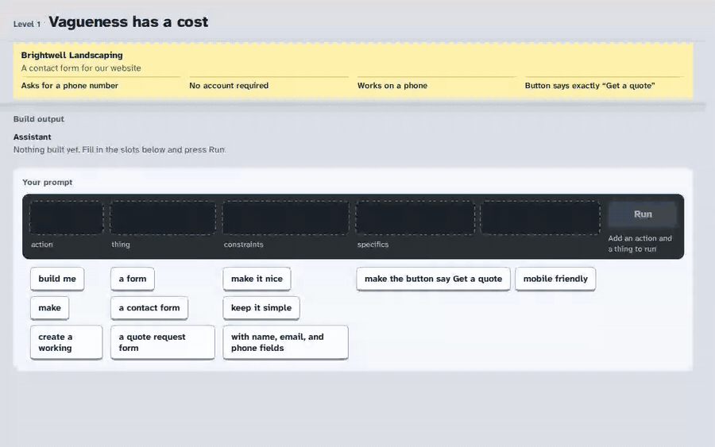

# Prompt Game

A browser game about directing AI coding assistants. It works like Scratch, but the blocks are
prompt fragments. You compose a prompt, a simulated AI builds what it heard, and you check the
result against the client's brief before anyone ships it.

**[Play it in your browser →](https://sbrush24.github.io/prompt-game/)** No install, no sign-up, about two minutes.



**Level 1: Vagueness has a cost.** A landscaping company wants a contact form. The fragments you
leave vague get filled in with the AI's own defaults, and the AI's report always sounds confident.
Above: "build me a form, make it nice" gets a password field nobody asked for, a "Submit" button,
and a hero layout that overflows the phone. The AI calls it ready to ship. The brief disagrees on
all four counts.

## Why the AI is simulated

The obvious version of this game calls a real model. I didn't, for four reasons:

- **The failure has to be guaranteed.** The lesson is that a vague prompt gets filled in with
  someone else's defaults. A real model might guess right by luck, or fail differently every run,
  and then the level teaches nothing. Here a vague prompt fails the same way every time, and a
  precise one passes every time.
- **It's testable.** The interpreter is a pure function from placed fragments to a build spec, so
  every prompt the rail can produce (144) is graded in CI and checked against a snapshot. You
  can't snapshot-test a live model.
- **No key, no bill, no backend.** It's static files. It runs from GitHub Pages or by
  double-clicking `index.html`, and nobody can run up an API bill by playing it.
- **The confidence is authored.** The AI's report is written from the build spec, so it always
  describes what it actually built, and always sounds sure of itself. That gap between the
  confident report and the brief is the thing the player is meant to learn to check.

The trade-off: the player picks from fixed fragments instead of typing freely, so the game teaches
a habit (be explicit about what matters, then verify) rather than any one model's quirks.

## How it works

- `js/level1.js` holds everything the level says and decides, as data: the fragments, what each
  one does to the build, the AI's defaults, the report and the brief.
- `js/interpreter.js` is the simulated AI. It is deterministic: each fragment's effects apply in
  order of how plainly they were said (implied < vague < explicit), and the last write wins. It
  also records which chip caused each property, so a failed brief item can point at the chip
  behind it.
- `js/renderer.js` draws the built page into a desktop frame and a phone frame at real CSS pixel
  widths, so a layout that is too wide for a phone really is too wide.
- `js/builder.js` is the prompt rail. Chips move by drag, by tap, or by keyboard.
- `js/review.js` is the brief: tick what you think the build does, then check it.

## Tests

```sh
npm test
```

This needs Node 22.14 or later. The tests build every prompt the rail can produce (144 of them)
and check the grades against `tests/outcomes.snapshot.json`. After an intended content change,
regenerate the snapshot with `node --test --test-update-snapshots tests/*.test.mjs` and review
the diff.

`tests/render-check.html` is the visual half: open it in a browser and it draws all 144 builds in
both device frames and confirms that what's on screen agrees with the grader.

## What I'd do differently

- **Teach the controls on screen.** Placing a chip is tap-the-chip, then tap-the-socket, and
  nothing says so until you've already tapped a chip. I tested the logic exhaustively and the
  first ten seconds of a new player not at all.
- **Run the render check in CI.** `tests/render-check.html` passes, but only when someone opens
  it. It should run headless on every push, next to the Node tests, so a CSS change can't
  silently make the phone frame lie.
- **Make the brief data, not code.** Each requirement is a JavaScript function (`met(spec)`),
  so a second level means writing code. Declarative checks (`field.phone must be true`) would
  let levels be authored as content and validated before they load.

## Run it locally

Clone the repo and open `index.html` in a current browser. There is no build step, no server and
no dependencies.

## Credits

The typeface is [Atkinson Hyperlegible Next](https://github.com/googlefonts/atkinson-hyperlegible-next),
used under the SIL Open Font License (`fonts/OFL.txt`).
